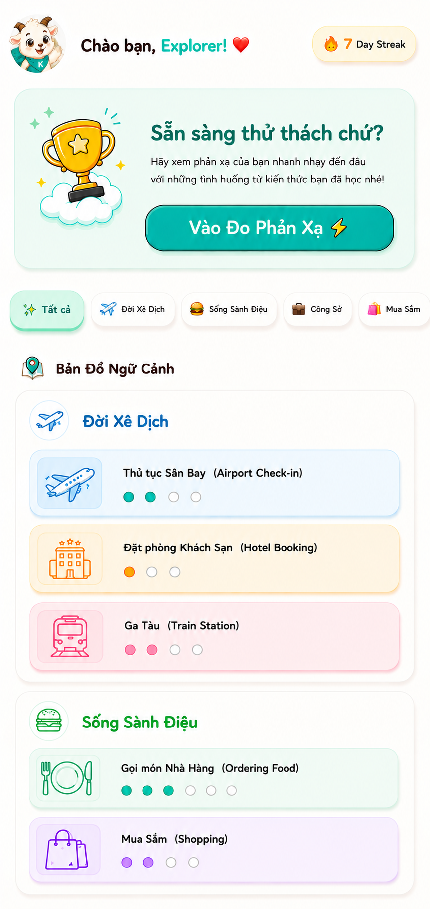
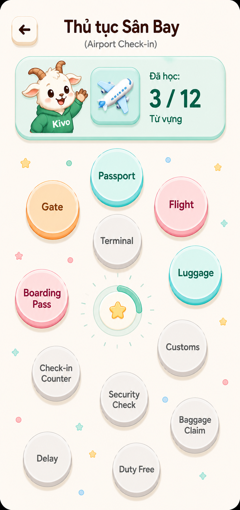
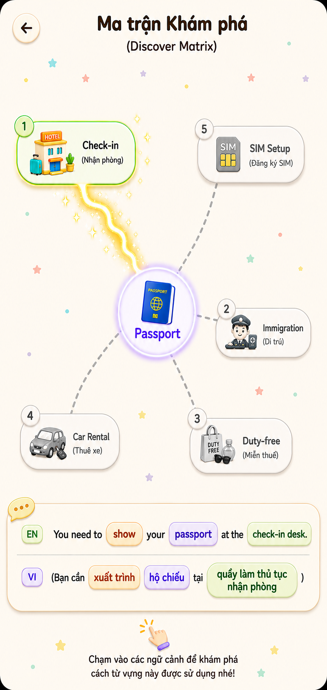
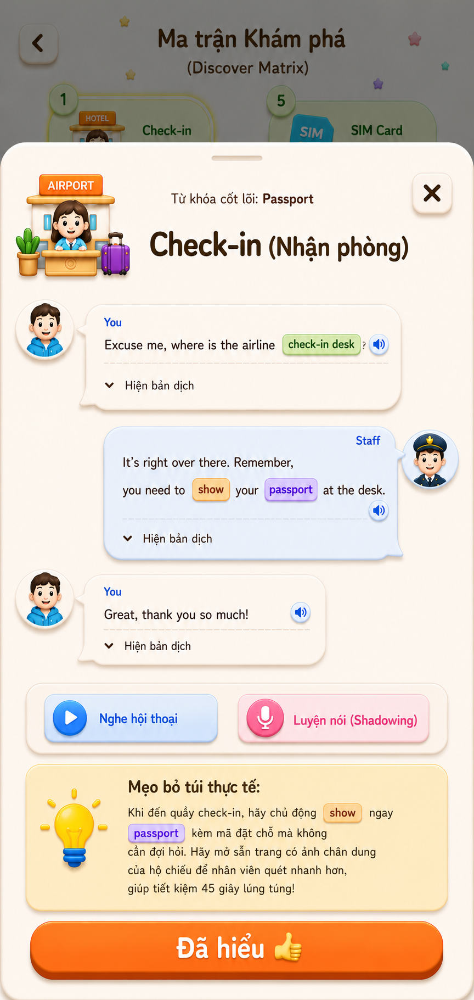
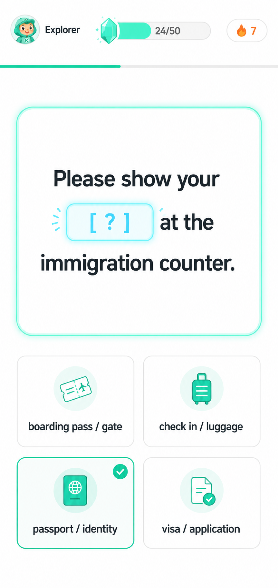
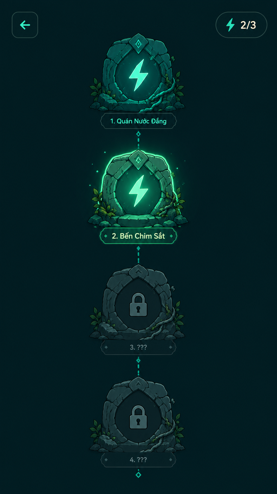
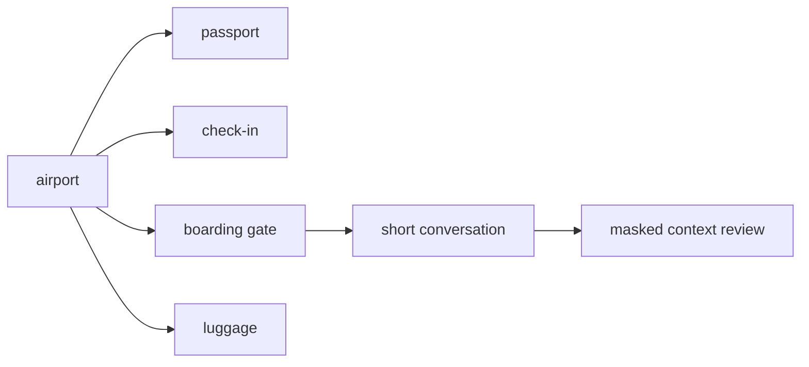
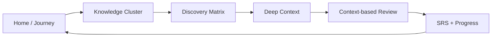

# KivoMap

<p align="center">
  
  <br />
  <strong>A product-first English learning app built around context, exploration, and repetition.</strong>
</p>

<p align="center">
  <a href="https://flutter.dev"></a>
  
  
  
</p>

KivoMap is not a Flutter demo project.

It is a product-first attempt to rethink how vocabulary should be learned through meaningful contexts, guided discovery, and lightweight spaced repetition.

## The Problem

Traditional English learning apps often teach vocabulary as isolated words.

Learners may remember that `airport` means `san bay`, but still struggle to use the word naturally in a real travel situation: checking in, showing a passport, finding a boarding gate, asking about luggage, or understanding a short conversation.

KivoMap addresses this by organizing vocabulary inside meaningful context maps instead of disconnected lists.

## Product Soul

KivoMap is built around a simple belief:

> Vocabulary is easier to remember when learners can see where it lives.

The goal is not to gamify everything. The goal is to make learning feel approachable, memorable, and emotionally easier to return to.

| Product Layer | What It Means | Why It Matters |
| --- | --- | --- |
| Context | Words are connected to examples, situations, and nearby meanings. | Learners remember how a word behaves, not only what it translates to. |
| Journey | Progress appears through maps, clusters, gates, discovery states, and review paths. | Learning feels like returning to a place, not clearing a checklist. |
| Companion | Kivo acts as a warm guide across normal learning and challenge moments. | The app feels friendly without hiding the learning goal. |

## UI Design Preview

> These are product UI designs. Flutter implementation is currently in progress, so these images show the intended interface direction rather than final runtime screenshots.

<p align="center">
  
  
  
</p>

<p align="center">
  
  
  
</p>

| Designed Experience | Purpose |
| --- | --- |
| Home Dashboard | Gives learners a friendly entry point into review, progress, and the context map. |
| Vocabulary Planet | Turns a topic into a spatial vocabulary map instead of a flat word list. |
| Discovery Matrix | Lets learners explore contextual links around one vocabulary item. |
| Deep Context | Shows practical examples and meaning support inside a focused learning moment. |
| Review | Reinforces memory through masked context prompts. |
| Passageway | Adds a darker challenge layer after the core learning loop is stable. |

## How Kivo Works

Imagine learning the word `airport`.

Instead of memorizing a single translation:

```text
airport = san bay
```

KivoMap lets the learner explore a travel scenario:



The learner does not only learn what a word means. They learn where it appears, what usually comes with it, and how to recognize it again later.

## Core Learning Loop



| Engine | Purpose | Product Decision |
| --- | --- | --- |
| Discovery | Explore vocabulary through contextual links and real examples. | A word should be understood inside a cluster, not as a detached card. |
| Repetition / SRS | Reinforce memory through masked context sentences. | Review stays focused and binary so it supports recall without becoming noisy. |

## Design Process

KivoMap was designed from business analysis before implementation, so every feature has to support the core learning loop.

| Step | Output |
| --- | --- |
| Product Charter | Defined why KivoMap exists and what learning problem it solves. |
| Business Analysis | Scoped the MVP around Discovery, SRS, progress, and guided learning. |
| Functional Requirements | Converted learning flows into app features and user actions. |
| Business Rules | Protected the product from unrelated social, marketplace, or generic flashcard features. |
| Domain Model | Structured users, clusters, vocabulary, contexts, review records, and progress. |
| Database Design | Planned Firestore collections and runtime bootstrap data. |
| ADRs | Recorded architectural decisions for icons, state management, and responsive scaling. |

## Read The Design Documents

- [Product Scope Contract](docs/product_scope_contract.md)
- [UI Style Guide](docs/ui_style_guide.md)
- [Engineering Rules](docs/engineering_rules.md)
- [Architecture Decision Records](docs/adr)

## Feature Scope

| Area | Current Product Role |
| --- | --- |
| Home Dashboard | Entry point for journey progress, review, and context map overview. |
| Cluster Learning | Topic-based vocabulary map with visible learning progress. |
| Discovery Matrix | Context-link exploration around a selected vocabulary item. |
| Deep Context | Practical examples, dialogue-style context, and meaning support. |
| Review Queue | Binary context-based review flow with SRS state updates. |
| Progress | Streak, unlocked vocabulary, energy, and learning statistics. |
| Passageway | Dark Challenge Mode for story, gates, failure, and completion flows. |

Out of scope for the MVP: social feeds, comments, follows, leaderboards, payments, creator tools, generic flashcards detached from context, and free-form AI content as the primary learning source.

## Project Status

| Area | Status |
| --- | --- |
| Business Analysis | `[##########]` Complete foundation |
| Product Scope | `[##########]` MVP boundaries defined |
| UI Design | `[##########]` Product screens designed |
| UI Direction | `[#########-]` Visual system documented |
| Firestore Design | `[#########-]` Schema and seed data in progress |
| Flutter UI Implementation | `[#######---]` Core screens in progress |
| Review / SRS | `[######----]` Product flow defined, implementation ongoing |
| Challenge Layer | `[####------]` Planned after the core learning loop is stable |

## Visual Direction

KivoMap has two emotional modes.

| Mode | Used For | Feeling |
| --- | --- | --- |
| Light Learning Mode | Login, Home, Vocabulary Planet, Discovery, Review, Profile | Friendly, soft, warm, playful, low-friction |
| Dark Challenge Mode | Story, Passageway, Mystery Gate, Challenge fail/complete | Magical, mysterious, higher-stakes, reward-driven |

The visual rule is simple: the app should never feel like plain Material UI. Learning screens need a clear visual anchor, and challenge screens need atmosphere without sacrificing readability.

## Engineering Approach

KivoMap uses a feature-first MVVM structure.

```text
lib/
  app/          shared theme, assets, icons, responsive scale, bindings
  data/         Firestore models, repositories, services, seed/bootstrap data
  features/     user-facing product features
```

Core rules:

- Views compose widgets and observe ViewModels.
- ViewModels coordinate state and user intents.
- Repositories own Firestore reads and writes.
- Services own domain workflows and transaction boundaries.
- UI never receives raw Firestore maps or snapshots.

## Tech Stack

| Area | Tools / Skills |
| --- | --- |
| Product | Business analysis, functional scope, business rules, learning loop design |
| Design | UI style guide, visual modes, mascot-led experience, information architecture |
| App | Flutter, Dart |
| State | GetX |
| Backend | Firebase Core, Cloud Firestore, Firebase Storage |
| UI System | flutter_screenutil, Phosphor icons, custom Kivo theme tokens |
| Architecture | Feature-first MVVM, repository/service boundaries, ADRs |

## Roadmap

- Complete the core Discovery flow with deep context details.
- Connect Review Queue to context-based SRS state updates.
- Expand progress tracking across journey, streak, energy, and unlocked vocabulary.
- Replace UI design previews with runtime screenshots as screens stabilize.
- Build Passageway / Dark Challenge Mode after the learning loop is reliable.

## Run Locally

```bash
flutter pub get
flutter run
```

## Product Guardrail

Before building a feature, KivoMap asks:

```text
BA section:
Product engine served: Discovery | Repetition/SRS | Supporting infrastructure
User value:
Out-of-scope risks:
```

If a feature cannot name the product engine it supports, it should not enter the MVP without a BA update.
